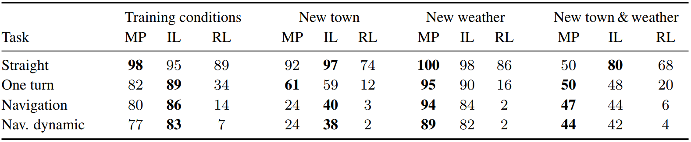

Machine Learning with Carla
=============================

There are three kinds of machine learning methodologies which apply for
different scenarios:

.. glossary::

  Supervised Learning
    given data, predict labels

  Unsupervised Learning
    given data, learn about that data

  Reinforcement Learning
    given data, choose action to maximize expected long-term reward

Driving Approaches
--------------------
In the original Carla paper [1], there are three driving approaches used for
simulating autonomous driving. Relevant papers have been cited at the bottom
of this page.

.. graphviz::
   :caption: Driving Approaches
   :align: center

   digraph {
      "Driving Approaches" -> "Modular Pipeline", "Imitation Learning",
                              "Reinforcement Learning";
   }

.. graphviz::
   :caption: Modular Pipeline
   :align: center

   digraph {
      "Modular Pipeline" -> "Perception", "Local Planner",
                            "Continuous Controller";
   }

.. graphviz::
   :caption: Imitation Learning
   :align: center

   digraph {
      "Imitation Learning" -> "Driving Dataset", "Noise Injection",
                              "Train Deep Network";
   }

.. graphviz::
   :caption: Driving Dataset
   :align: center

   digraph {
      "Driving Dataset" -> "Observations", "Commands", "Actions";
   }

.. graphviz::
   :caption: Reinforcement Learning
   :align: center

   digraph {
      "Reinforcement Learning" -> "Asynchronous advantage actor-critic (A3C) algorithm" -> "Goal", "Reward", "Optimize Hyperparameters";
   }

Results
-------

   Quantitative evaluation of three autonomous driving systems on goal-directed
   navigation tasks. The table reports the percentage of successfully completed
   episodes in each condition. Higher is better. [1]

  Average distance (in kilometers) traveled between two infractions.
  Higher is better. [1]

It is easy to infer from the tables above that the imitation learning algorithm
is the most robust algorithm among the three. For more information regarding
it, kindly read the original paper.

Available Parameters
---------------------
Commands:
  - Steering [-1, 1]
  - Throttle [0, 1]
  - Brake [0, 1]
  - Handbrake (bool)
  - Reverse Gear (bool)

Meta-commands:
  - # vehicles (int)
  - # pedestrians (int)
  - Weather ID (int)
  - Spawn seed
  - Camera params (pos, orient, FOV, res, type)
  - Camera types (RGB, Depth, Semantic Segmentation)
  - Town (1 or 2)

Measurements:
  - Player Pos (3D float vect)
  - Player Speed (float) [km/h]
  - Collision
  - Opp. Lane Intersection (%)
  - Sidewalk Intersection (%)
  - Time
  - Player Acc (3D float vect)
  - Player Orient (unit vect)
  - Sensor (camera readings)
  - NPC Pos, Orient & Bounding boxes
  - Traffic Light Info (pos & state of ALL traffic lights)
  - Speed Limit Sign Info (pos & readings from ALL signs)

References
-------------

- [1] A. Dosovitskiy, G. Ros, F. Codevilla, A. Lopez, and V. Koltun,
  “CARLA: An Open Urban Driving Simulator,”
  `arXiv:1711.03938 <https://arxiv.org/abs/1711.03938>`_ [cs], Nov. 2017.

- [2] F. Codevilla, M. Müller, A. López, V. Koltun, and A. Dosovitskiy,
  “End-to-end Driving via Conditional Imitation Learning,”
  `arXiv:1710.02410 <https://arxiv.org/abs/1710.02410>`_
  [cs], Oct. 2017.

- [3] X. Liang, T. Wang, L. Yang, and E. Xing, “CIRL: Controllable Imitative
  Reinforcement Learning for Vision-based Self-driving,”
  `arXiv:1807.03776 <https://arxiv.org/abs/1807.03776>`_ [cs],
  Jul. 2018.
