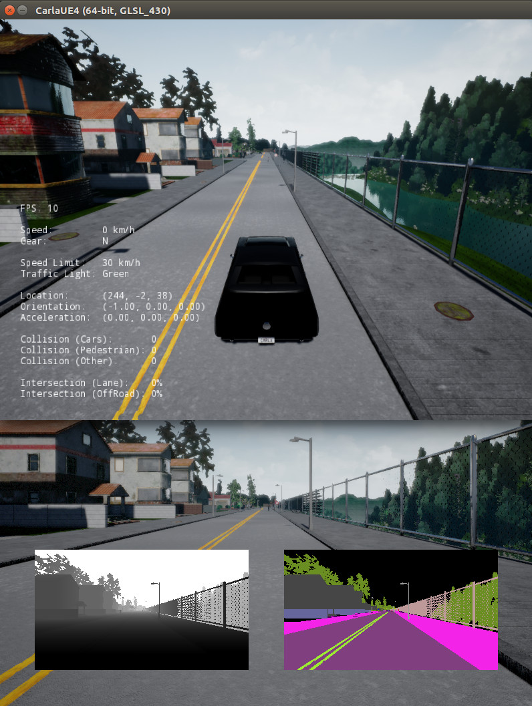

Carla Installation
========================

Testing Environment:
  | **Motherboard:** MSI MS-7A63
  | **OS:** Linux (Ubuntu 16.04.1)
  | **CPU:** Intel(R) Core(TM) i7-7700K CPU @ 4.20GHz; 8 cores
  | **RAM:** 32GB
  | **GPU:** NVIDIA GeForce GTX 1080 12GB
  | **NVIDIA Driver:** Driver v396.54; OpenGL v4.6.0

Prerequisites
*****************

The Carla `documentation <https://carla.readthedocs.io/en/stable/>`_ and
`GitHub <https://github.com/carla-simulator/carla>`_ are very useful resources
for Carla.

Knowlegde prerequisites:
  - Linux
  - Python
  - Git

System prerequisites:
  - Ubuntu 16.04.1
  - Python 3 (3.5.2)

.. note:: Although Carla can be run on Windows machines, it is recommened to
          use a Linux environment for machine learning research.

There are three ways to install CARLA depending on your needs.

1. Pre-compiled version:

   - \+ Quick to setup
   - \+ Small directory size (~5GB)
   - \- Cannot edit the default maps

2. Source version:

   - \+ Have complete control over simulator environment
   - \- Requires separate Unreal Engine 4 installation
   - \- Slow to setup
   - \- Large file size (~30GB)

3. Docker container

   - \+ Very portable
   - \+ Can be used to run multiple instances of Carla on multiple GPUs
   - \- May be challenging for first time docker users

Installation
*****************

.. note:: For all testing purposes we will be using **Carla 0.8.2 (stable)**
          version. The Pre-compiled version is recommended for first time users.

Pre-compiled version
--------------------------

1. Download the **[Linux] CARLA_0.8.2.tar.gz** compiled version from
   `Carla's 0.8.2 (stable) Releases GitHub page
   <https://github.com/carla-simulator/carla/releases/tag/0.8.2>`_

2. Create a new working directory and move the downloaded file there:

  .. code-block:: bash

     mkdir carla
     cd carla
     mv ~/Downloads/CARLA_0.8.2.tar.gz .

3. Extract the tar.gz file:

  .. code-block:: bash

     tar -xzvf CARLA_0.8.2.tar.gz

.. note::

   The tar arguements you just used are as follows:
     - x: eXtract
     - z: use gZip uncompression algorithm
     - v: provide Verbose output
     - f: next arguement would be the tar.gz File

4. Run Carla:

   .. code-block:: bash

      ./CarlaUE4.sh

This should open the Carla environment where the following keys can be used
to control the vehicle:

Manual Control:
  | W - accelerate
  | A - turn left
  | D - turn right
  | S - deccelerate
  | Q - switch gears (reverse/forward)
  | P - autopilot

Source version
--------------------------

1. Follow the instructions in Carla
`documentation's 'How to build on Linux' <https://carla.readthedocs.io/en/stable/how_to_build_on_linux/>`_
page. Be sure to install **Carla 0.8.2 (stable)** source code version alongside
**Unreal Engine 4.18**.

.. note::

   To keep clean directories, it may help to install Unreal Engine in the
   ``~\packages\UnrealEngine_4.28`` directory and carla in the
   ``~\projects\carla`` directory.

.. note::

   If you have previous Anaconda installations, you may need to comment
   out the lines pertaining to them in the ``~/.bashrc`` file.

.. note::

   If ``make`` commands do not work for building carla, run the ``Setup.sh``
   file. This would involve a ~10GB asset download.

.. note::

  If you run into an issue while running the above commands, with errors
  like lib.so is missing, you should run ``Rebuild.sh``.

2. Once both Unreal Engine and Carla have been installed, navigate to the
   carla folder and run the following commands:

.. code-block:: bash

  export UE4_ROOT=<your_path_to_UE4>/UnrealEngine_4.18
  ${UE4_ROOT}/Engine/Binaries/Linux/UE4Editor "<your_path_to_carla>/carla-0.8.2/Unreal/CarlaUE4/CarlaUE4.uproject"

3. To make your life easier you can put them in a shell script:

   .. code-block:: bash

      touch CarlaUE4.sh
      echo 'export UE4_ROOT=<your_path_to_UE4>/UnrealEngine_4.18' >> CarlaUE4.sh
      echo '${UE4_ROOT}/Engine/Binaries/Linux/UE4Editor "<your_path_to_carla>/carla-0.8.2/Unreal/CarlaUE4/CarlaUE4.uproject"' >> CarlaUE4.sh
      chmod +X CarlaUE4.sh

Then to run the script you can use the command ``./CarlaUE4.sh``.

This will open up the UE4 Editor with Carla loaded into it.

4. Press the play (right point arrow head) above the viewport to run Carla within
   the Unreal Editor. This will let you control the vehicle.

The following keys can be used to control the vehicle:

Manual Control:
 | W - accelerate
 | A - turn left
 | D - turn right
 | S - deccelerate
 | Q - switch gears (reverse/forward)
 | P - autopilot

Docker version
--------------------------

Docker containers wrap a piece of software in a complete filesystem that
contains everything needed to run: code, runtime, system tools, system
libraries – anything that can be installed on a server. This guarantees that
the software will always run the same, regardless of its environment.

The docker version of CARLA is usually meant to be run on a server, and is
typically headless (without a simulator window). This decreases the overhead
for rendering the environment.
The primary instruction set for installing the CARLA docker can be found in the
`official documentation <https://carla.readthedocs.io/en/latest/carla_docker/>`_.

.. note::

   If you are a Washington University researcher, steps 1 and 2 can be skipped.

1. Install Docker CE (Community Edition) for your operating system:

   - `Ubuntu <https://docs.docker.com/install/linux/docker-ce/ubuntu/>`_
   - `Centos <https://docs.docker.com/install/linux/docker-ce/centos/>`_
   - `Windows <https://docs.docker.com/docker-for-windows/install/>`_
   - `MacOS <https://docs.docker.com/docker-for-mac/>`_

2. Install `nvidia-docker2` using the official `NVIDIA guide
<https://github.com/NVIDIA/nvidia-docker/wiki/Installation-(version-2.0)>`_.

3. Pull the CARLA image:

.. code-block:: bash

   docker pull carlasim/carla:0.8.2

.. note::

   ``sudo`` will be required for running docker commands unless you are added to
   the docker usergroup. Use
   `<this guide https://docs.docker.com/install/linux/linux-postinstall/>`_ to
   do so. If you do not have sudo access on the server that you are using, ask
   your server admin to add you to the docker group.

.. note::

   The CARLA docker image that is pulled does not contain the PythonClient files.
   Additionally, it does not contain Python libraries. It is meant to be run as
   a standalone server to which you can connect a Python client. Use the
   pre-compiled guide from above to acquire the PythonClient files.

Reference:

- `Running the simulator <https://carla.readthedocs.io/en/stable/running_simulator_standalone/>`_

Carla Server
*****************

When we have been using WASD to control the vehicle in Carla, we have been using
Carla as a standalone package. But if we want to it communicate with Python,
we need to run it as a server.

Notice the ``PythonClient\`` folder in the carla directory.

Carla has the following parameter arguements:

Pre-compiled version
--------------------------

.. note::

   It may be a good idea to limit the fps and resolution while running carla.

1. On terminal one, run:

   .. code-block:: bash

      ./CarlaUE4.sh -carla-server /Game/Maps/Town02 -benchmark -fps=10 -windowed -ResX=800 -ResY=600

2. Open a new terminal navigate to the ``PythonClient`` directory:

   .. code-block:: bash

      cd PythonClient

3. Append the carla directory to the Python path, to allow python to use the
   carla library:

   .. code-block:: bash

      export PYTHONPATH=~/projects/carla-0.8.2/PythonClient:$PYTHONPATH

To prevent you from entering this command every time, you can add the above line
to your ``~/.bashrc`` file and run the command ``source ~/.bashrc`` which refreshes
your linux profile parameters.

4. Run one of the Python examples in the ``PythonClient`` directory. Example:

   .. code-block:: bash

      python3 manual_control.py

.. note::

   This may require the **pygame** library. Install it using the
   command: ``pip3 install pygame --user``.

This lets you control the vehicle using the WASD keys on the PyGame window.

   Carla simulator (top) with PyGame window (bottom) camera view

Note the bottom left mini-image is the depth map and the on the the right is
the semantic segmented camera view.

.. note::

   As an alternative to using the arguement ``-carla-server``, the
   ``Example.CarlaSettings.ini`` file in the carla directory can be edited
   to suit your need. For example ``UseNetworking=true`` would run carla as a
   server without using ``-carla-server``. But you would have to pass that
   ``.ini`` file as a param:
   ``./CarlaUE4.sh -carla-settings=Example.CarlaSettings.ini``

Source version
--------------------------

1. Open the ``carla/Unrael/CarlaUE4/Config/CarlaSettings.ini`` file with a
   text edit.

2. Change ``UseNetworking=false`` to ``UseNetworking=true``

3. Press the play button, and follow steps 2 to 4 from the above (pre-compiled)
   section.

Docker version
--------------------------

1. Run the CARLA server using Docker:

.. code-block:: bash

   docker run -p 2000-2002:2000-2002 --runtime=nvidia -e NVIDIA_VISIBLE_DEVICES=0 carlasim/carla:0.8.2

.. note::

   ``-p 2000-2002:2000-2002`` argument is to redirect host ports for the docker
   container.

.. note::

   ``NVIDIA_VISIBLE_DEVICES=0`` makes the docker run on GPU ID 0. GPU listing
   can be acquired using the command ``nvidia-smi``.

2. Open a new terminal and navigate to the PythonClient directory from the
pre-compiled version.

3. Run one of the Python examples in the ``PythonClient`` directory. Example:

   .. code-block:: bash

      python3 manual_control.py

.. note::

   This may require the **pygame** library. Install it using the
   command: ``pip3 install pygame --user``.
